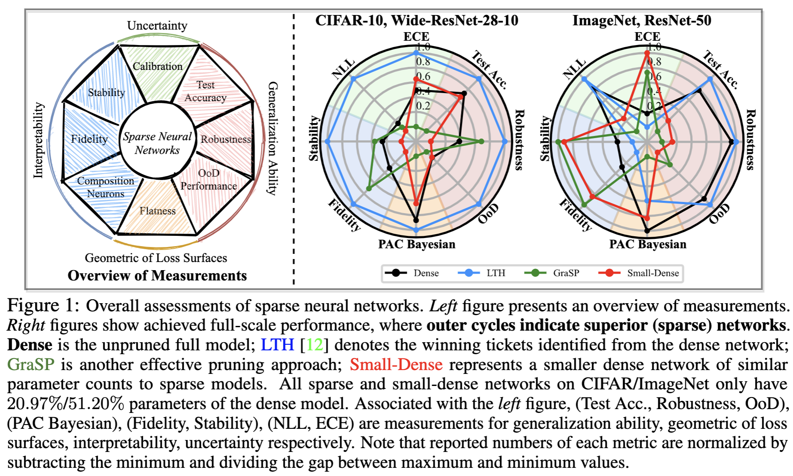

# Can You Win Everything with Lottery Ticket?

[](https://opensource.org/licenses/MIT)

Code for this **preprint** paper [Can You Win Everything with Lottery Ticket?]()

Tianlong Chen, Zhenyu Zhang, Sijia Liu, Shiyu Chang, Zhangyang Wang

## Overview


## Experiment Results




## Prerequisites

- pytorch

- torchvision

- advertorch


## Usages

Evaluation on CIFAR-10/100 

```
python -u main_eval.py \
	--data [data-direction] \
	--dataset cifar10 \ # choose from [cifar10, cifar100]
	--arch resnet20s \ # choose from [resnet20s,resnet18,wideresnet]
	--pretrained [pretrained-weight] \ 
	--eval_mode accuracy,robustness,corruption,ood,calibration,interpretation,pac_bayes_weight,pac_bayes_input \
	--output_file result.pt \
	--test_randinit_off \
	--image_number 1000 
```

Evaluation on ImageNet 

```
python -u main_eval_imagenet.py \
    --data [data-direction] \
    --arch resnet50 \
    --pretrained [pretrained-weight] \
    --eval_mode accuracy,robustness,corruption,ood,calibration,interpretation,pac_bayes_weight,pac_bayes_input \
    --output_file result.pt 
```

Evaluation for Hessian

```
python -u vis_pyhessian_analysis.py \
    --data [data-direction] \
    --dataset [dataset] \ choose from [cifar10, cifar100, imagenet]
    --arch [network-architecture] \ choose from [resnet20s,resnet18,wideresnet,resnet50]
    --pretrained [pretrained-weight] \
    --output_file result.pt \
    --mode weight,input
```

Composition neurons

`cd composition-neuron`, which is modified from https://github.com/jayelm/compexp

## Citation

```
TBD
```

